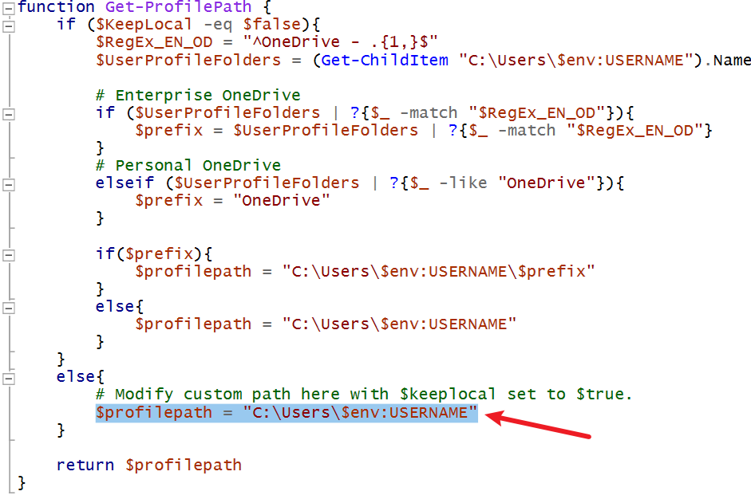

# <center>My Case Tracker


## How to use:

Right click->Run with Powershell


## How to switch CSV on Local/OneDrive path:

Change `$KeepLocal` to `$true` or `$false` under **variables** block

```powershell
[Bool]$KeepLocal = $false
```


## Where is CSV stored?

By default, the CSV is stored on **Documents** folder

>  If OneDrive is installed, it will set with OneDrive-Documents folder


## What if I want change the name of CSV?

Change `$Filename`line to  under **variables** block

```bash
$Filename = <custom_csv_name>
```


## What if I want change the CSV to custom path?

1.  Set`$KeepLocal` to $true under **variables** block

   ```bash
   [Bool]$KeepLocal = $true
   ```

   

2. Find function **Get-ProfilePath**, modify the `$profilepath` in main **else** block

```bash
    else{
        # Modify custom path here with $keeplocal set to $true.
        $profilepath = <your_custom_path>
    }
```



