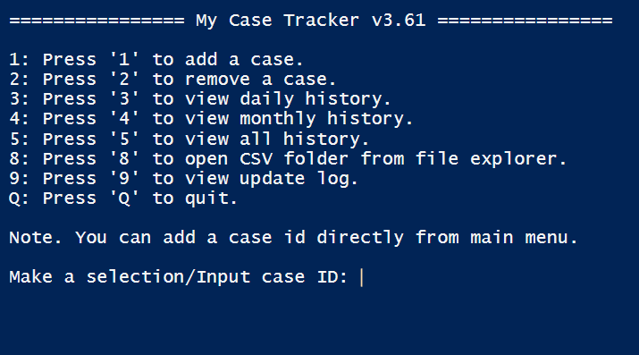

# <center>My Case Tracker





## How to Use:

Right click->Run with Powershell


## How to Change Daily Target:

Modify`$target` to under **variables** block

> by default daily target is 35 

```powershell
$target = 35
```


## How to Switch CSV on Local/OneDrive path:

Change `$KeepLocal` to `$true` or `$false` under **variables** block

> by default is false, script will automatically find OneDrive path and locate if possible.

```powershell
[Bool]$KeepLocal = $false
```


## Where is CSV Stored?

By default, the CSV is stored on **Documents** folder

>  If OneDrive is installed, it will set with OneDrive-Documents folder


## What if I Want Change The Name of CSV?

Change `$Filename`line to  under **variables** block

```bash
$Filename = <custom_csv_name>
```


## What if I Want Change the CSV to Custom Path?

1.  Set`$KeepLocal` to $true under **variables** block

   ```bash
   [Bool]$KeepLocal = $true
   ```

   

2. Find function **Get-ProfilePath**, modify the `$profilepath` in main **else** block

```bash
    else{
        # Modify custom path here with $keeplocal set to $true.
        $profilepath = <your_custom_path>
    }
```


