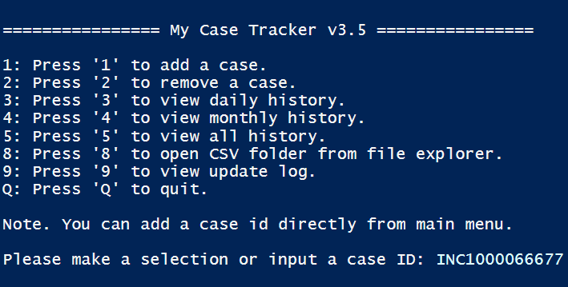

# <center>My Case Tracker





**How to use:**

Right click->Run with Powershell


**How to switch CSV on Local/OneDrive path:**

Change below line to `$true` or `$false` under **variables** block

```powershell
[Bool]$KeepLocal = $false
```

